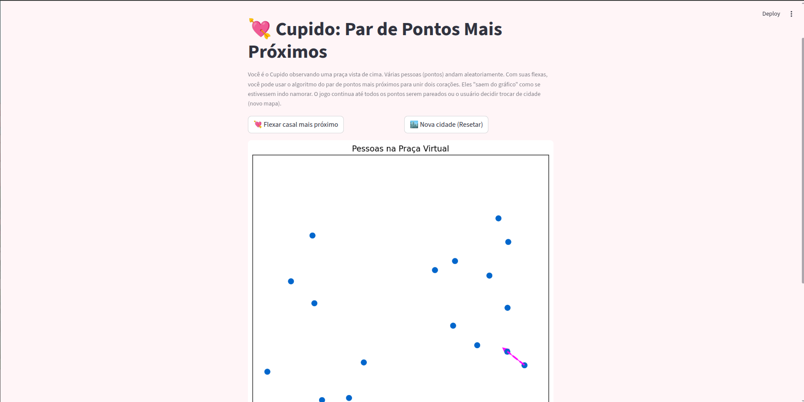
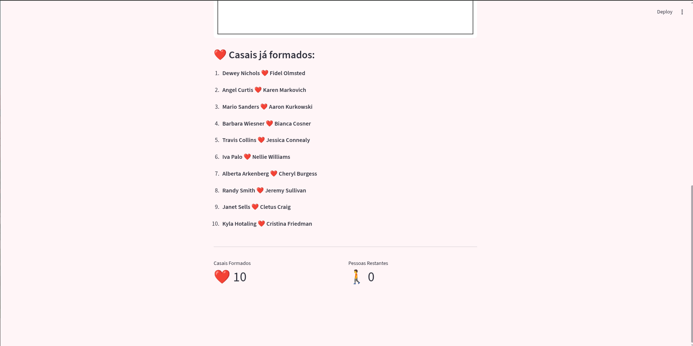

# Cupido: Par de Pontos Mais Próximos

**Conteúdo da Disciplina**: Dividir e Conquistar<br>

## Alunos
|Matrícula | Aluno |
| -- | -- |
| 22/2021890  |  Manuella Magalhães Valadares |
| 22/2021906  |  Marcos Vieira Marinho |

## Link do vídeo de apresentação do projeto

[Link da Apresentacao](https://youtu.be/WW5rD5R4rC0?si=H3OenllcEQwAhiHN)

## ℹ️ Sobre o Projeto

Você é o **Cupido** observando uma praça vista de cima. Várias pessoas (pontos) andam aleatoriamente. Com suas flechas, você pode usar o algoritmo do par de pontos mais próximos para unir dois corações. Eles "saem do gráfico" como se estivessem indo namorar. O jogo continua até todos os pontos serem pareados ou o usuário decidir trocar de cidade (novo mapa).


## Screenshots

Clique nas imagens para assistir uma demonstração

[](https://www.youtube.com/watch?v=HwRLZ7BuL8s)
[](https://www.youtube.com/watch?v=HwRLZ7BuL8s)


## Instalação 
**Linguagem**: Python<br>
**Framework**: Streamlit<br>
**Pré-requisitos**: Python 3.8+

1. **Clone o repositório:**
```bash
git clone https://github.com/projeto-de-algoritmos-2025/DC-Cupido.git
cd DC-Cupido
```
2. **Instale as dependências:**
```bash
pip install streamlit matplotlib streamlit-autorefresh names
```
## Uso 
Depois de instalar tudo corretamente, execute o seguinte comando no terminal:
```bash
streamlit run main.py
```
### Na interface web:

1. **🏙️ Visualização da Praça**: 
   - Pontos azuis representam pessoas solteiras andando pela praça
   - Uma linha roxa tracejada conecta o par mais próximo em tempo real (onde a flecha do cupido está mais propícia a cair)

2. **💘 Flechar casal mais próximo**: 
   - Clique neste botão para formar um casal com as duas pessoas mais próximas a partir do algoritmo de par de pontos mais próximos
   - O par se torna vermelho e seus nomes aparecem no gráfico
   - Após 3 segundos, o casal "sai da praça"
   - Uma mensagem de sucesso mostra os nomes do novo casal

3. **🏙️ Nova cidade (Resetar)**:
   - Gera uma nova praça com 20 pessoas aleatórias
   - Redefine todos os contadores e limpa a lista de casais

4. **📊 Acompanhe o progresso**:
   - **Casais Formados**: contador de casais unidos
   - **Pessoas Restantes**: quantas pessoas ainda estão na praça
   - **Lista de Casais**: histórico completo dos casais formados

5. **🎯 Objetivo**: Continue formando casais até que todas as pessoas encontrem seu par!

